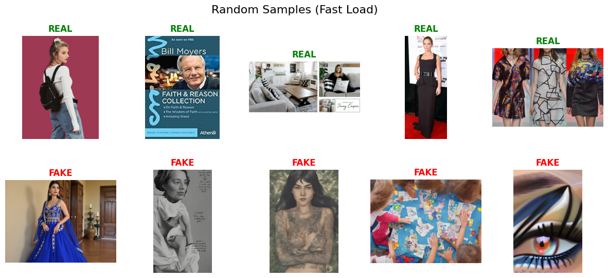
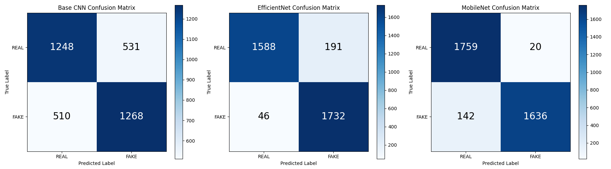

# <h1 align="center">Real Vs AI generated Image Classification</h1>

<div align="center">
  
</div>

# <h1 align="center">TABLE OF CONTENT</h1>


1. [Deskripsi Project](#-deskripsi-project-)
      - [Latar Belakang](#latar-belakang)
      - [Tujuan Pengembangan](#tujuan-pengembangan)
2. [Sumber Dataset](#-sumber-dataset-)
3. [Preprocessing dan Pemodelan](#-preprocessing-dan-pemodelan-)
      - [Pemilihan Fitur / Feature Extraction Strategy](#pemilihan-fitur--feature-extraction-strategy)
      - [Preprocessing Data](#preprocessing-data)
      - [Pemodelan](#pemodelan)
4. [Langkah Instalasi](#-langkah-instalasi-)
      - [Software Utama](#software-utama)
      - [Dependensi](#dependensi)
      - [Menjalankan Sistem Prediksi](#menjalankan-sistem-prediksi)
      - [Pelatihan Model](#pelatihan-model)
5. [Hasil dan Analisis](#-hasil-dan-analisis-)
      - [Evaluasi Model](#evaluasi-model )
6. [Sistem Streamlit (Demo)](#-sistem-streamlit-demo-)
      - [Tampilan](#tampilan)
      - [Link Live Demo](#link-live-demo)
7. [Authors & Citation](#-authors--citation-)  

---


<h1 align="center">📚 Deskripsi Project 📚</h1>

**Note:** This README is formatted as a NeurIPS-style research README template for an image forensics / detection study. Replace placeholder values (bracketed) with your exact experimental details before submission.

### Latar Belakang
The rapid advancement of AI image generation technologies has led to an increase in synthetic images, particularly deepfakes depicting politically relevant content such as public figures, events, and memes, posing significant risks to misinformation and societal trust. Current deepfake detection methods often struggle with robustness across diverse content types and generators, especially in politically charged media where accuracy is critical. We hypothesize that Convolutional Neural Networks (CNNs) trained on a balanced dataset of real and synthetic images can effectively learn discriminative features to detect AI-generated content with high reliability.

### Tujuan Pengembangan
The primary goal of this project is to develop and train CNN-based models, including Base CNN, EfficientNet, and MobileNet, for binary classification of real versus AI-generated images using the OpenFake dataset. We aim to achieve robust performance in detecting synthetic images across various categories such as faces, events, and memes, with a particular focus on political content. To ensure reproducibility, we release the training code in a Jupyter notebook, along with trained model weights and evaluation scripts for transparent and reproducible results. Ethically, we utilize the OpenFake dataset under the CC-BY-SA-4.0 license, ensuring responsible use and noting limitations in handling sensitive political imagery to avoid misuse.  

---
<h1 align="center">📊 Sumber Dataset 📊</h1>

- **Real images:** Images labeled as 'real' from the [OpenFake dataset](https://huggingface.co/datasets/ComplexDataLab/OpenFake), consisting of authentic photographs including faces of public figures, events, and other content.
- **AI-generated images:** Images labeled as 'fake' from the [OpenFake dataset](https://huggingface.co/datasets/ComplexDataLab/OpenFake), generated using various AI models to create synthetic content with political relevance, including faces, events (e.g., disasters, protests), and multimodal meme-style images with text overlays.
- **Generation pipeline (if self-generated):** The dataset is curated from existing sources; synthetic images are produced by multiple AI generators as documented in the dataset metadata.
- **Splits:** Train: ~27,485 images (80% of the train split), Val: ~6,871 images (20% of the train split), Test: 3,557 images (from the dedicated test split). The splits ensure no overlap between train, validation, and test sets.
- **Augmentations applied (test-time augmentations):** Standard image preprocessing including resizing and normalization; no additional test-time augmentations specified.
- **Deduplication:** Images are deduplicated based on perceptual hashing to ensure exclusivity across splits.
- **Download command / reproduction:**
```
# Install datasets library
pip install datasets

# Load the dataset in Python
from datasets import load_dataset
ds = load_dataset("ComplexDataLab/OpenFake")
```

### Sample Images


---

<h1 align="center">🧑‍💻 Preprocessing dan Pemodelan 🧑‍💻</h1>


### Pemilihan Fitur / Feature Extraction Strategy

- **Input space:** RGB pixels resized to 224x224 for model input.
- **Metadata:** Images are converted to RGB format if necessary; no EXIF data or generator metadata (prompts/seeds) are used as model inputs.
- **Hand-crafted features (optional):** None; features are learned end-to-end by the CNN models.
- **Patch sampling:** Whole images are used without patch sampling.
- **Deduplication:** Images are deduplicated based on perceptual hashing as provided by the dataset.
- **Notes:** Preprocessing includes resizing, tensor conversion, and ImageNet normalization.

graph TB
    Start[Raw Image] --> RGB{RGB Format?}
    RGB -->|No| Convert[Convert to RGB]
    RGB -->|Yes| Resize[Resize to 224x224]
    Convert --> Resize
    
    Resize --> Tensor[Convert to Tensor]
    Tensor --> Norm["ImageNet Normalization<br/>mean=[0.485, 0.456, 0.406]<br/>std=[0.229, 0.224, 0.225]"]
    Norm --> Model[Model Input]
    
    Start -.->|Not Used| EXIF[EXIF Data]
    Start -.->|Not Used| Meta[Generator Metadata<br/>prompts/seeds]
    
    Hand[Hand-crafted Features] -.->|Not Used| Model
    CNN[End-to-end CNN Learning] -->|Used| Model
    
    Whole[Whole Images] -->|Used| Model
    Patch[Patch Sampling] -.->|Not Used| Model
    
    Dedup[Perceptual Hash Deduplication] -.->|Dataset Level| Start
    
    style EXIF fill:#ffcccc
    style Meta fill:#ffcccc
    style Hand fill:#ffcccc
    style Patch fill:#ffcccc
    style CNN fill:#ccffcc
    style Whole fill:#ccffcc
    style Model fill:#cce5ff

### Preprocessing Data

- **Standardization / resizing pipeline:** Images are resized to 224x224 pixels, converted to PyTorch tensors, and normalized using ImageNet mean and standard deviation (mean=[0.485, 0.456, 0.406], std=[0.229, 0.224, 0.225]).
- **Augmentations (training):** No additional data augmentations such as flips, crops, or compressions are applied; only the basic preprocessing pipeline is used.
- **Test-time perturbations:** No test-time augmentations or perturbations are specified in the notebook.
- **Deduplication & splits:** The dataset's train split is divided into 80% for training and 20% for validation using random_split with a fixed seed (42) for reproducibility. The test split is used as-is for evaluation. Deduplication is handled by the dataset using perceptual hashing.
- **Notes:** Preprocessing is implemented using torchvision.transforms.Compose for the custom CNN, and AutoImageProcessor for pre-trained models like EfficientNet and MobileNet.

graph LR
    subgraph Dataset
        DS[Original Dataset] --> Dedup[Perceptual Hash<br/>Deduplication]
        Dedup --> TrainSplit[Train Split]
        Dedup --> TestSplit[Test Split]
    end
    
    subgraph Data Splitting
        TrainSplit --> Split{random_split<br/>seed=42}
        Split -->|80%| Train[Training Set]
        Split -->|20%| Val[Validation Set]
        TestSplit --> Test[Test Set<br/>as-is]
    end
    
    subgraph Preprocessing Pipeline
        Train --> PP1[Preprocessing]
        Val --> PP2[Preprocessing]
        Test --> PP3[Preprocessing]
        
        PP1 --> R1[Resize 224x224]
        PP2 --> R2[Resize 224x224]
        PP3 --> R3[Resize 224x224]
        
        R1 --> T1[To Tensor]
        R2 --> T2[To Tensor]
        R3 --> T3[To Tensor]
        
        T1 --> N1[Normalize<br/>ImageNet Stats]
        T2 --> N2[Normalize<br/>ImageNet Stats]
        T3 --> N3[Normalize<br/>ImageNet Stats]
    end
    
    subgraph Implementation
        N1 --> Custom1[Custom CNN:<br/>torchvision.transforms.Compose]
        N2 --> Custom2[Custom CNN:<br/>torchvision.transforms.Compose]
        N3 --> Custom3[Custom CNN:<br/>torchvision.transforms.Compose]
        
        N1 --> Pre1[Pretrained Models:<br/>AutoImageProcessor]
        N2 --> Pre2[Pretrained Models:<br/>AutoImageProcessor]
        N3 --> Pre3[Pretrained Models:<br/>AutoImageProcessor]
    end
    
    subgraph Not Applied
        Aug[Data Augmentations<br/>flips, crops, compressions]
        TTA[Test-time Augmentations]
    end
    
    style Aug fill:#ffcccc
    style TTA fill:#ffcccc
    style Train fill:#ccffcc
    style Val fill:#ffffcc
    style Test fill:#ffeecc
    style Dedup fill:#cce5ff
---

### Pemodelan

**Model overview**

- **Architectures (3 models):**
  1. **Custom CNN** — 4 convolutional blocks with filters [32, 64, 128, 256]; each block uses Batch Normalization and Max Pooling. Dropout (p=0.5) is applied before Global Average Pooling. Classifier: two fully-connected layers (128 -> 1).
  2. **EfficientNetV2-S** — pre-trained (`timm/tf_efficientnetv2_s.in21k`), fine-tuned for binary classification.
  3. **MobileNetV2** — pre-trained (`google/mobilenet_v2_1.0_224`), fine-tuned for binary classification.

**What’s new / design choices**

- **Novelty:** The Custom CNN prioritizes efficiency (lightweight, fewer parameters) for fast training and inference. EfficientNetV2-S and MobileNetV2 leverage ImageNet transfer learning to improve generalization on high-fidelity synthetic images.

**Loss & optimization**

- **Loss:**
  - Custom CNN: `BCEWithLogitsLoss` (stable for single-logit binary setup).
  - Pre-trained models (HF Trainer): default cross-entropy (as used by the Transformers Trainer wrappers).
- **Optimizers & hyperparameters:**
  - Optimizer: Adam (all models).
  - Learning rate: 1e-3 (default for experiments).
  - Weight decay: 0.01.
  - Mixed precision: FP16 enabled for EfficientNet and MobileNet training.

**Training protocol**

- **Epochs:** 3 for all models.
- **Batch settings:**
  - Custom CNN: `batch_size=256`.
  - EfficientNetV2-S: `batch_size=128`, `gradient_accumulation_steps=8`.
  - MobileNetV2: `batch_size=128`, `gradient_accumulation_steps=1`.

**Evaluation**

- **Metrics:** Accuracy, F1-score, and AUROC.
- **When evaluated:** Validation metrics are computed during training (periodic checkpoints) and final performance is reported on the held-out test set.

**Hardware & runtime**

- Training was performed on Google Colab with GPU (NVIDIA T4 / L4). Typical wall-clock time per model: ~1–2 hours (varies by model and Colab instance).

**Reproducibility**

- Training code and pipelines are provided in `Train_UAP.ipynb`.
- Model checkpoints are saved in Safetensors format for reproducible loading and inference.


<h1 align="center">🔧 Langkah Instalasi 🔧</h1>

### Software Utama
- **Python:** 3.10+ (recommended)
- **PyTorch:** 2.0+
- **CUDA:** 11.8+ (for GPU acceleration)
- **Hugging Face Transformers:** For pre-trained models
- **Google Colab:** Recommended environment for running the notebook

### Dependensi
Install the required packages using the provided requirements.txt file:
```bash
pip install -r requirements.txt
```
Key dependencies include: torch, torchvision, transformers, datasets, pillow, scikit-learn, matplotlib, wandb, safetensors.

### Menjalankan Sistem Prediksi
Prediction is performed within the Train_UAP.ipynb notebook. Load the trained models (Base CNN, EfficientNet, MobileNet) and run predictions on individual images or the test set. The notebook includes code for loading Safetensors checkpoints and computing predictions with probabilities.

### Pelatihan Model
Training is conducted via the Train_UAP.ipynb Jupyter notebook. The notebook includes cells for data loading, preprocessing, model definition, training loops, and evaluation. Run the notebook in Google Colab or a local Jupyter environment with GPU support. Models are trained for 3 epochs each, with checkpoints saved in Safetensors format.

---


<h1 align="center">🔍 Hasil dan Analisis 🔍</h1>


#### Model Performance — Summary 📈
The table below reports test-set performance (Accuracy, Precision, Recall, F1-Score) for each model, with a short analysis explaining the observed scores.

| Model | Accuracy | Precision | Recall | F1-Score | Analysis |
|---|---:|---:|---:|---:|---|
| Base CNN | 0.7073376440820917 | 0.7048360200111173 | 0.7131608548931384 | 0.7089740005591277 | Lower-capacity model trained from scratch; limited pretraining and fewer parameters reduce feature richness and robustness to high-fidelity fakes and compressed images. |
| EfficientNet | 0.9333708181051448 | 0.9006760270410816 | 0.9741282339707537 | 0.9359632531748177 | High-capacity, pretrained model (in21k) that transfers well — high recall indicates it captures most fakes; slightly lower precision suggests sensitivity to compression/artifact-like patterns producing some FPs. |
| MobileNet | 0.9544560022490863 | 0.9879227053140096 | 0.9201349831271091 | 0.9528246942341293 | Compact, well-finetuned model with very high precision (few false positives); slightly lower recall indicates conservative positive predictions or missed generator styles — good for high-precision deployment. |

<div align="center">
  
  <p><strong>Confusion Matrix (Test set)</strong></p>
</div>

> **Note:** The confusion matrix above shows aggregated test-set predictions; per-model confusion matrices (if available) are in `images/`.

##### Learning Curves — Custom CNN 🔧
Below are the training and validation learning curves for **Custom CNN (Model 1)** showing accuracy and loss over epochs. These plots help visualize training dynamics and potential overfitting.

<table>
  <tr>
    <td align="center">
      
      <p><strong>Train Accuracy</strong></p>
    </td>
    <td align="center">
      
      <p><strong>Validation Accuracy</strong></p>
    </td>
  </tr>
  <tr>
    <td align="center">
      
      <p><strong>Train Loss</strong></p>
    </td>
    <td align="center">
      
      <p><strong>Validation Loss</strong></p>
    </td>
  </tr>
</table>

##### Run metadata (CustomCNN) 🧾
Summary of the run used to generate the learning curves:

| Field | Value |
|---|---|
| Architecture | **CustomCNN** |
| Epochs | **30** |
| GPU | **NVIDIA L4 (24.15 GB)** |
| CUDA | **12.4** |
| Python | **CPython 3.12.12** |
| OS | **Linux-6.6.105+-x86_64-with-glibc2.35** |
| CPU | **6 physical (12 logical)** |
| RAM | **56.86 GB** |
| Disk (used / total) | **79.07 GB / 253.06 GB** |
| Started at | **2025-12-20T18:05:11.222007Z** |
| Notebook (Colab) | **Train_UAP.ipynb** |
| W&B user | **haeriz42069@gmail.com** |

<details>
<summary>Show full raw wandb JSON</summary>

```json
{
  "_wandb": {
    "value": {
      "e": {
        "9touszew26yc9vx8z0hjbtxhmkdub6x9": {
          "os": "Linux-6.6.105+-x86_64-with-glibc2.35",
          "gpu": "NVIDIA L4",
          "disk": {
            "/": {
              "used": "79066517504",
              "total": "253055008768"
            }
          },
          "host": "6d79419a6a67",
          "root": "/content",
          "colab": "https://colab.research.google.com/notebook#fileId=1oV23bX5PYz7nCbNXouspa9DAzuPt7HAM",
          "email": "haeriz42069@gmail.com",
          "memory": {
            "total": "56863338496"
          },
          "python": "CPython 3.12.12",
          "program": "Train%20UAP.ipynb",
          "codePath": "Train%20UAP.ipynb",
          "writerId": "9touszew26yc9vx8z0hjbtxhmkdub6x9",
          "cpu_count": 6,
          "gpu_count": 1,
          "startedAt": "2025-12-20T18:05:11.222007Z",
          "executable": "/usr/bin/python3",
          "gpu_nvidia": [
            {
              "name": "NVIDIA L4",
              "uuid": "GPU-54e552a1-2d75-e2fd-a524-40da35699d77",
              "cudaCores": 7424,
              "memoryTotal": "24152899584",
              "architecture": "Ada"
            }
          ],
          "cudaVersion": "12.4",
          "cpu_count_logical": 12
        }
      },
      "m": [
        {
          "1": "global_step",
          "6": [
            3
          ],
          "7": []
        },
        {
          "2": "train/*",
          "5": 1,
          "6": [
            1
          ],
          "7": []
        },
        {
          "2": "val/*",
          "5": 1,
          "6": [
            1
          ],
          "7": []
        }
      ],
      "t": {
        "1": [
          1,
          41,
          49,
          51,
          105
        ],
        "2": [
          1,
          41,
          49,
          51,
          105
        ],
        "3": [
          2,
          7,
          13,
          16
        ],
        "4": "3.12.12",
        "5": "0.23.1",
        "8": [
          1,
          12
        ],
        "12": "0.23.1",
        "13": "linux-x86_64"
      },
      "cli_version": "0.23.1",
      "python_version": "3.12.12"
    }
  },
  "epochs": {
    "value": 30
  },
  "architecture": {
    "value": "CustomCNN"
  }
}
``` 


##### Learning Curves — EfficientNet 🔧
A full gallery of EfficientNetV2 training and evaluation plots with a short caption and a 1-line interpretation for each figure.

<table>
  <tr>
    <td align="center">
      
      <p><strong>Train (per-epoch metric)</strong><br><em>Per-epoch training summary — shows overall training behaviour.</em></p>
    </td>
    <td align="center">
      
      <p><strong>Train (global steps)</strong><br><em>Confirms global step progression and logging cadence.</em></p>
    </td>
    <td align="center">
      
      <p><strong>Train Loss</strong><br><em>Training loss decreases over time, indicating learning.</em></p>
    </td>
  </tr>
  <tr>
    <td align="center">
      
      <p><strong>Learning Rate</strong><br><em>Shows learning rate schedule (linear/step) used during training.</em></p>
    </td>
    <td align="center">
      
      <p><strong>Grad Norm</strong><br><em>Monitors gradient norms to detect instability or clipping.</em></p>
    </td>
    <td align="center">
      
      <p><strong>Eval Checkpoints</strong><br><em>Evaluation checkpoints showing selected metrics over time.</em></p>
    </td>
  </tr>
  <tr>
    <td align="center">
      
      <p><strong>Eval AUROC</strong><br><em>AUROC trend; higher values indicate improved discriminative performance.</em></p>
    </td>
    <td align="center">
      
      <p><strong>Eval F1</strong><br><em>F1 score over evaluation checkpoints; balances precision and recall.</em></p>
    </td>
    <td align="center">
      
      <p><strong>Eval Loss</strong><br><em>Validation loss trend — check for divergence from training loss (overfitting).</em></p>
    </td>
  </tr>
  <tr>
    <td align="center">
      
      <p><strong>Eval Runtime</strong><br><em>Per-evaluation runtime — helps identify slow checkpoints or I/O issues.</em></p>
    </td>
    <td align="center">
      
      <p><strong>Sample Predictions</strong><br><em>Example model outputs / sample visualization.</em></p>
    </td>
    <td align="center">
      <em>(end of gallery)</em>
    </td>
  </tr>
</table>

**Short interpretations (one-liners)**

- Train loss: decreases steadily — model converges across epochs.
- Eval metrics (AUROC / F1): improve during early checkpoints then level off, indicating stable performance.
- Grad norm: generally stable; no sustained gradient explosions.
- Learning rate: linear/step schedule applied as configured.
- Eval runtime / steps: consistent with expected evaluation cadence.

**Run summary (EfficientNet trainer)**

| Field | Value |
|---|---|
| Run name | **EfficientNetV2_HF_Trainer** |
| Architecture | **timm/tf_efficientnetv2_s.in21k (tf_efficientnetv2_s)** |
| Num params | **20,180,050** |
| Num epochs | **3** |
| Train batch size | **128** |
| Eval batch size | **256** |
| Gradient accumulation | **8** |
| Learning rate | **0.001** |
| Optimizer | **adamw_torch_fused** |
| FP16 | **true (mixed precision)** |
| GPU | **NVIDIA L4 (24.15 GB)** |
| CUDA | **12.4** |
| Python | **CPython 3.12.12** |
| Started at | **2025-12-21T08:29:48.572366Z** |
| Output dir | `/content/drive/MyDrive/deepfake_checkpoints/efficientnet_finetuned` |
| Num features | **1280** |

<details>
<summary>Show full raw wandb JSON & config</summary>

```json
{
  "bf16": { "value": false },
  "fp16": { "value": true },
  "fsdp": { "value": [] },
  "seed": { "value": 42 },
  "tf32": { "value": null },
  "debug": { "value": [] },
  "dtype": { "value": "float32" },
  "optim": { "value": "adamw_torch_fused" },
  "top_k": { "value": 50 },
  "top_p": { "value": 1 },
  "_wandb": {
    "value": {
      "e": {
        "2hd6w3bdgcympw5w80gu7gohxv8md58h": {
          "os": "Linux-6.6.105+-x86_64-with-glibc2.35",
          "gpu": "NVIDIA L4",
          "disk": { "/": { "used": "79375151104", "total": "253055008768" } },
          "host": "3e382e360a3f",
          "root": "/content",
          "colab": "https://colab.research.google.com/notebook#fileId=1oV23bX5PYz7nCbNXouspa9DAzuPt7HAM",
          "email": "haeriz42069@gmail.com",
          "memory": { "total": "56863338496" },
          "python": "CPython 3.12.12",
          "program": "Train%20UAP.ipynb",
          "cpu_count": 6,
          "gpu_count": 1,
          "startedAt": "2025-12-21T08:29:48.572366Z",
          "executable": "/usr/bin/python3",
          "gpu_nvidia": [ { "name": "NVIDIA L4", "uuid": "GPU-096733aa-f426-d278-3583-f6e7deaa749a", "cudaCores": 7424, "memoryTotal": "24152899584", "architecture": "Ada" } ],
          "cudaVersion": "12.4",
          "cpu_count_logical": 12
        }
      },
      "m": [ { "1": "train/global_step", "6": [3], "7": [] }, { "2": "*", "5": 1, "6": [1], "7": [] } ],
      "t": { "1": [1,2,3,5,11,12,41,49,51,53,63,71,98,105], "2": [1,2,3,5,11,12,41,49,51,53,63,71,98,105], "3": [2,7,13,19,62,66], "4": "3.12.12", "5": "0.23.1", "6": "4.57.3", "8": [1,12], "9": { "1": "transformers_trainer" }, "12": "0.23.1", "13": "linux-x86_64" },
      "cli_version": "0.23.1",
      "python_version": "3.12.12"
    }
  },
  "prefix": { "value": null },
  "do_eval": { "value": true },
  "no_cuda": { "value": false },
  "project": { "value": "huggingface" },
  "use_cpu": { "value": false },
  "do_train": { "value": false },
  "run_name": { "value": "EfficientNetV2_HF_Trainer" },
  "output_dir": { "value": "/content/drive/MyDrive/deepfake_checkpoints/efficientnet_finetuned" },
  "save_steps": { "value": 10 },
  "logging_dir": { "value": "/content/drive/MyDrive/deepfake_checkpoints/efficientnet_finetuned/runs/Dec21_08-39-30_3e382e360a3f" },
  "num_train_epochs": { "value": 3 },
  "model/num_parameters": { "value": 20180050 },
  "learning_rate": { "value": 0.001 },
  "per_device_train_batch_size": { "value": 128 },
  "per_device_eval_batch_size": { "value": 256 },
  "gradient_accumulation_steps": { "value": 8 },
  "architectures": { "value": ["TimmWrapperForImageClassification"] }
}
```

</details>


##### Learning Curves — MobileNet 🔧
A full gallery of MobileNet training and evaluation plots with a short caption and a 1-line interpretation for each figure.

<table>
  <tr>
    <td align="center">
      
      <p><strong>Train (per-epoch metric)</strong><br><em>Shows per-epoch training metrics; trends indicate stability across epochs.</em></p>
    </td>
    <td align="center">
      
      <p><strong>Train (global steps)</strong><br><em>Confirms global step progression and logging cadence.</em></p>
    </td>
    <td align="center">
      
      <p><strong>Train Loss</strong><br><em>Training loss decreases over time, indicating learning.</em></p>
    </td>
  </tr>
  <tr>
    <td align="center">
      
      <p><strong>Learning Rate</strong><br><em>Shows learning rate schedule (step/decay) used during training.</em></p>
    </td>
    <td align="center">
      
      <p><strong>Grad Norm</strong><br><em>Tracks gradient norms — useful to spot instability or clipping.</em></p>
    </td>
    <td align="center">
      
      <p><strong>Eval Steps</strong><br><em>Evaluation recorded at regular steps during training.</em></p>
    </td>
  </tr>
  <tr>
    <td align="center">
      
      <p><strong>Eval AUROC</strong><br><em>AUROC trend; higher values indicate improved discriminative performance.</em></p>
    </td>
    <td align="center">
      
      <p><strong>Eval F1</strong><br><em>F1 score over evaluation checkpoints; balances precision and recall.</em></p>
    </td>
    <td align="center">
      
      <p><strong>Eval Loss</strong><br><em>Validation loss trend — check for divergence from training loss (overfitting).</em></p>
    </td>
  </tr>
  <tr>
    <td align="center">
      
      <p><strong>Eval Runtime</strong><br><em>Per-evaluation runtime — helps identify slow checkpoints or I/O issues.</em></p>
    </td>
    <td align="center">
      
      <p><strong>Sample Predictions</strong><br><em>Example model outputs / sample visualization.</em></p>
    </td>
    <td align="center">
      <em>(end of gallery)</em>
    </td>
  </tr>
</table>

**Short interpretations (one-liners)**

- Train loss: decreases steadily — model is converging.
- Eval metrics (AUROC / F1): show improvement during early checkpoints, then stabilize.
- Grad norm: stable overall; no sustained explosive gradients observed.
- Learning rate: scheduled decay as configured (see `Train-lr`).
- Eval runtime / steps: evaluation cadence and runtime are consistent with the training configuration.

**Run summary (Hugging Face Trainer)**

| Field | Value |
|---|---|
| Run name | **MobileNetV2_HF_Trainer** |
| Architecture | **google/mobilenet_v2_1.0_224** |
| Num params | **2,226,434** |
| Num epochs | **3** |
| Train batch size | **128** |
| Eval batch size | **256** |
| Learning rate | **0.001** |
| Optimizer | **adamw_torch_fused** |
| FP16 | **true (mixed precision)** |
| GPU | **NVIDIA L4 (24.15 GB)** |
| CUDA | **12.4** |
| Python | **CPython 3.12.12** |
| Started at | **2025-12-21T08:06:45.583504Z** |
| Output dir | `/content/drive/MyDrive/deepfake_checkpoints/mobilenet_finetuned` |

<details>
<summary>Show full raw wandb JSON & config</summary>

```json
{
  "bf16": {
    "value": false
  },
  "fp16": {
    "value": true
  },
  "fsdp": {
    "value": []
  },
  "seed": {
    "value": 42
  },
  "tf32": {
    "value": null
  },
  "debug": {
    "value": []
  },
  "dtype": {
    "value": "float32"
  },
  "optim": {
    "value": "adamw_torch_fused"
  },
  "top_k": {
    "value": 50
  },
  "top_p": {
    "value": 1
  },
  "_wandb": {
    "value": {
      "e": {
        "abw548etxtw0ss6q7uijk2jceanabfgw": {
          "os": "Linux-6.6.105+-x86_64-with-glibc2.35",
          "gpu": "NVIDIA L4",
          "disk": {
            "/": {
              "used": "79127801856",
              "total": "253055008768"
            }
          },
          "host": "3e382e360a3f",
          "root": "/content",
          "colab": "https://colab.research.google.com/notebook#fileId=1oV23bX5PYz7nCbNXouspa9DAzuPt7HAM",
          "email": "haeriz42069@gmail.com",
          "memory": {
            "total": "56863338496"
          },
          "python": "CPython 3.12.12",
          "program": "Train%20UAP.ipynb",
          "codePath": "Train%20UAP.ipynb",
          "writerId": "abw548etxtw0ss6q7uijk2jceanabfgw",
          "cpu_count": 6,
          "gpu_count": 1,
          "startedAt": "2025-12-21T08:06:45.583504Z",
          "executable": "/usr/bin/python3",
          "gpu_nvidia": [
            {
              "name": "NVIDIA L4",
              "uuid": "GPU-096733aa-f426-d278-3583-f6e7deaa749a",
              "cudaCores": 7424,
              "memoryTotal": "24152899584",
              "architecture": "Ada"
            }
          ],
          "cudaVersion": "12.4",
          "cpu_count_logical": 12
        }
      },
      "m": [
        {
          "1": "train/global_step",
          "6": [
            3
          ],
          "7": []
        },
        {
          "2": "*",
          "5": 1,
          "6": [
            1
          ],
          "7": []
        }
      ],
      "t": {
        "1": [
          1,
          2,
          3,
          5,
          11,
          12,
          41,
          49,
          51,
          53,
          71,
          98,
          105
        ],
        "2": [
          1,
          2,
          3,
          5,
          11,
          12,
          41,
          49,
          51,
          53,
          71,
          98,
          105
        ],
        "3": [
          2,
          7,
          13,
          19,
          62,
          66
        ],
        "4": "3.12.12",
        "5": "0.23.1",
        "6": "4.57.3",
        "8": [
          1,
          12
        ],
        "9": {
          "1": "transformers_trainer"
        },
        "12": "0.23.1",
        "13": "linux-x86_64"
      },
      "cli_version": "0.23.1",
      "python_version": "3.12.12"
    }
  },
  "prefix": {
    "value": null
  },
  "do_eval": {
    "value": true
  },
  "no_cuda": {
    "value": false
  },
  "project": {
    "value": "huggingface"
  },
  "use_cpu": {
    "value": false
  },
  "do_train": {
    "value": false
  },
  "id2label": {
    "value": {
      "0": "LABEL_0",
      "1": "LABEL_1"
    }
  },
  "label2id": {
    "value": {
      "LABEL_0": 0,
      "LABEL_1": 1
    }
  },
  "run_name": {
    "value": "MobileNetV2_HF_Trainer"
  },
  "adafactor": {
    "value": false
  },
  "data_seed": {
    "value": null
  },
  "deepspeed": {
    "value": null
  },
  "do_sample": {
    "value": false
  },
  "hub_token": {
    "value": "<HUB_TOKEN>"
  },
  "log_level": {
    "value": "passive"
  },
  "max_steps": {
    "value": -1
  },
  "min_depth": {
    "value": 8
  },
  "num_beams": {
    "value": 1
  },
  "ray_scope": {
    "value": "last"
  },
  "report_to": {
    "value": [
      "wandb"
    ]
  },
  "typical_p": {
    "value": 1
  },
  "adam_beta1": {
    "value": 0.9
  },
  "adam_beta2": {
    "value": 0.999
  },
  "do_predict": {
    "value": false
  },
  "eval_delay": {
    "value": 0
  },
  "eval_steps": {
    "value": 100
  },
  "hidden_act": {
    "value": "relu6"
  },
  "image_size": {
    "value": 224
  },
  "is_decoder": {
    "value": false
  },
  "local_rank": {
    "value": 0
  },
  "max_length": {
    "value": 20
  },
  "min_length": {
    "value": 0
  },
  "model_type": {
    "value": "mobilenet_v2"
  },
  "optim_args": {
    "value": null
  },
  "output_dir": {
    "value": "/content/drive/MyDrive/deepfake_checkpoints/mobilenet_finetuned"
  },
  "past_index": {
    "value": -1
  },
  "save_steps": {
    "value": 100
  },
  "tf_padding": {
    "value": true
  },
  "ddp_backend": {
    "value": null
  },
  "ddp_timeout": {
    "value": 1800
  },
  "fsdp_config": {
    "value": {
      "xla": false,
      "xla_fsdp_v2": false,
      "min_num_params": 0,
      "xla_fsdp_grad_ckpt": false
    }
  },
  "label_names": {
    "value": null
  },
  "logging_dir": {
    "value": "/content/drive/MyDrive/deepfake_checkpoints/mobilenet_finetuned/runs/Dec21_08-06-44_3e382e360a3f"
  },
  "push_to_hub": {
    "value": false
  },
  "return_dict": {
    "value": true
  },
  "temperature": {
    "value": 1
  },
  "torchdynamo": {
    "value": null
  },
  "torchscript": {
    "value": false
  },
  "adam_epsilon": {
    "value": 1e-8
  },
  "bos_token_id": {
    "value": null
  },
  "disable_tqdm": {
    "value": false
  },
  "eos_token_id": {
    "value": null
  },
  "expand_ratio": {
    "value": 6
  },
  "fp16_backend": {
    "value": "auto"
  },
  "hub_model_id": {
    "value": null
  },
  "hub_revision": {
    "value": null
  },
  "hub_strategy": {
    "value": "every_save"
  },
  "num_channels": {
    "value": 3
  },
  "pad_token_id": {
    "value": null
  },
  "problem_type": {
    "value": null
  },
  "sep_token_id": {
    "value": null
  },
  "use_bfloat16": {
    "value": false
  },
  "warmup_ratio": {
    "value": 0
  },
  "warmup_steps": {
    "value": 0
  },
  "weight_decay": {
    "value": 0.01
  },
  "_name_or_path": {
    "value": "google/mobilenet_v2_1.0_224"
  },
  "architectures": {
    "value": [
      "MobileNetV2ForImageClassification"
    ]
  },
  "bad_words_ids": {
    "value": null
  },
  "eval_on_start": {
    "value": false
  },
  "eval_strategy": {
    "value": "steps"
  },
  "jit_mode_eval": {
    "value": false
  },
  "learning_rate": {
    "value": 0.001
  },
  "logging_steps": {
    "value": 25
  },
  "max_grad_norm": {
    "value": 1
  },
  "mp_parameters": {
    "value": ""
  },
  "output_scores": {
    "value": false
  },
  "output_stride": {
    "value": 32
  },
  "save_strategy": {
    "value": "steps"
  },
  "torch_compile": {
    "value": false
  },
  "tpu_num_cores": {
    "value": null
  },
  "bf16_full_eval": {
    "value": false
  },
  "early_stopping": {
    "value": false
  },
  "fp16_full_eval": {
    "value": false
  },
  "fp16_opt_level": {
    "value": "O1"
  },
  "layer_norm_eps": {
    "value": 0.001
  },
  "length_penalty": {
    "value": 1
  },
  "tf_legacy_loss": {
    "value": false
  },
  "use_mps_device": {
    "value": false
  },
  "finetuning_task": {
    "value": null
  },
  "group_by_length": {
    "value": false
  },
  "hub_always_push": {
    "value": false
  },
  "num_beam_groups": {
    "value": 1
  },
  "save_only_model": {
    "value": false
  },
  "suppress_tokens": {
    "value": null
  },
  "tokenizer_class": {
    "value": null
  },
  "depth_multiplier": {
    "value": 1
  },
  "full_determinism": {
    "value": false
  },
  "hub_private_repo": {
    "value": null
  },
  "ignore_data_skip": {
    "value": false
  },
  "log_on_each_node": {
    "value": true
  },
  "logging_strategy": {
    "value": "steps"
  },
  "num_train_epochs": {
    "value": 3
  },
  "save_safetensors": {
    "value": true
  },
  "save_total_limit": {
    "value": 2
  },
  "trackio_space_id": {
    "value": "trackio"
  },
  "use_liger_kernel": {
    "value": false
  },
  "ddp_bucket_cap_mb": {
    "value": null
  },
  "diversity_penalty": {
    "value": 0
  },
  "greater_is_better": {
    "value": true
  },
  "initializer_range": {
    "value": 0.02
  },
  "log_level_replica": {
    "value": "warning"
  },
  "lr_scheduler_type": {
    "value": "linear"
  },
  "output_attentions": {
    "value": false
  },
  "push_to_hub_token": {
    "value": "<PUSH_TO_HUB_TOKEN>"
  },
  "save_on_each_node": {
    "value": false
  },
  "tpu_metrics_debug": {
    "value": false
  },
  "accelerator_config": {
    "value": {
      "even_batches": true,
      "non_blocking": false,
      "split_batches": false,
      "dispatch_batches": null,
      "use_seedable_sampler": true,
      "gradient_accumulation_kwargs": null
    }
  },
  "batch_eval_metrics": {
    "value": false
  },
  "depth_divisible_by": {
    "value": 8
  },
  "finegrained_output": {
    "value": true
  },
  "is_encoder_decoder": {
    "value": false
  },
  "length_column_name": {
    "value": "length"
  },
  "logging_first_step": {
    "value": false
  },
  "parallelism_config": {
    "value": null
  },
  "repetition_penalty": {
    "value": 1
  },
  "torch_compile_mode": {
    "value": null
  },
  "add_cross_attention": {
    "value": false
  },
  "forced_bos_token_id": {
    "value": null
  },
  "forced_eos_token_id": {
    "value": null
  },
  "fsdp_min_num_params": {
    "value": 0
  },
  "include_for_metrics": {
    "value": []
  },
  "liger_kernel_config": {
    "value": null
  },
  "neftune_noise_alpha": {
    "value": null
  },
  "skip_memory_metrics": {
    "value": true
  },
  "tie_encoder_decoder": {
    "value": false
  },
  "tie_word_embeddings": {
    "value": true
  },
  "auto_find_batch_size": {
    "value": false
  },
  "dataloader_drop_last": {
    "value": false
  },
  "model/num_parameters": {
    "value": 2226434
  },
  "no_repeat_ngram_size": {
    "value": 0
  },
  "num_return_sequences": {
    "value": 1
  },
  "optim_target_modules": {
    "value": null
  },
  "output_hidden_states": {
    "value": false
  },
  "overwrite_output_dir": {
    "value": false
  },
  "prediction_loss_only": {
    "value": false
  },
  "push_to_hub_model_id": {
    "value": null
  },
  "task_specific_params": {
    "value": null
  },
  "transformers_version": {
    "value": "4.57.3"
  },
  "begin_suppress_tokens": {
    "value": null
  },
  "dataloader_pin_memory": {
    "value": true
  },
  "ddp_broadcast_buffers": {
    "value": null
  },
  "metric_for_best_model": {
    "value": "f1"
  },
  "remove_invalid_values": {
    "value": false
  },
  "remove_unused_columns": {
    "value": false
  },
  "torch_compile_backend": {
    "value": null
  },
  "dataloader_num_workers": {
    "value": 2
  },
  "decoder_start_token_id": {
    "value": null
  },
  "eval_do_concat_batches": {
    "value": true
  },
  "eval_use_gather_object": {
    "value": false
  },
  "gradient_checkpointing": {
    "value": false
  },
  "half_precision_backend": {
    "value": "auto"
  },
  "label_smoothing_factor": {
    "value": 0
  },
  "load_best_model_at_end": {
    "value": true
  },
  "logging_nan_inf_filter": {
    "value": true
  },
  "resume_from_checkpoint": {
    "value": null
  },
  "chunk_size_feed_forward": {
    "value": 0
  },
  "classifier_dropout_prob": {
    "value": 0.2
  },
  "eval_accumulation_steps": {
    "value": null
  },
  "per_gpu_eval_batch_size": {
    "value": null
  },
  "return_dict_in_generate": {
    "value": false
  },
  "torch_empty_cache_steps": {
    "value": null
  },
  "first_layer_is_expansion": {
    "value": true
  },
  "per_gpu_train_batch_size": {
    "value": null
  },
  "push_to_hub_organization": {
    "value": null
  },
  "include_tokens_per_second": {
    "value": false
  },
  "dataloader_prefetch_factor": {
    "value": null
  },
  "ddp_find_unused_parameters": {
    "value": null
  },
  "include_inputs_for_metrics": {
    "value": false
  },
  "per_device_eval_batch_size": {
    "value": 256
  },
  "semantic_loss_ignore_index": {
    "value": 255
  },
  "use_legacy_prediction_loop": {
    "value": false
  },
  "cross_attention_hidden_size": {
    "value": null
  },
  "gradient_accumulation_steps": {
    "value": 1
  },
  "per_device_train_batch_size": {
    "value": 128
  },
  "encoder_no_repeat_ngram_size": {
    "value": 0
  },
  "average_tokens_across_devices": {
    "value": true
  },
  "dataloader_persistent_workers": {
    "value": false
  },
  "gradient_checkpointing_kwargs": {
    "value": null
  },
  "include_num_input_tokens_seen": {
    "value": "no"
  },
  "exponential_decay_length_penalty": {
    "value": null
  },
  "fsdp_transformer_layer_cls_to_wrap": {
    "value": null
  },
  "restore_callback_states_from_checkpoint": {
    "value": false
  }
}
```

</details>


---


</details>

---

<h1 align="center">🎓 Sistem Streamlit (Demo) 🎓</h1>

### Tampilan (Screenshots required)
- Desktop view showing: input upload, prediction probabilities, and heatmap overlay (explainability).  
- Mobile view (responsive).  
- Example: upload a real photo → show prediction and heatmap.  
- Example: upload an AI-generated image → show prediction and heatmap.

### Run locally
```bash
# Streamlit (tested on Streamlit v1.29.0)
streamlit run app.py
```

- If deployed on HuggingFace Spaces, add badge:  
`[]()`

---

#### Tampilan Hasil Prediksi
Refer to the '🎓 Sistem Streamlit (Demo) 🎓' section above for desktop/mobile screenshots, example uploads, and heatmap visualizations.  
Run locally: `streamlit run app.py` (tested on Streamlit v1.29.0).

---
#### Failure analysis & Ablations 🔍
We inspected representative examples from `images/Error` to understand common failure modes and guide remediation. Below is a concise visual summary (examples are cropped for readability) and targeted analysis.

<table>
  <tr>
    <td align="center">
      
      <p><strong>True Positive (Fake → detected)</strong></p>
    </td>
    <td align="center">
      
      <p><strong>True Negative (Real → correct)</strong></p>
    </td>
  </tr>
  <tr>
    <td align="center">
      
      <p><strong>False Positive (Real → predicted fake)</strong></p>
    </td>
    <td align="center">
      
      <p><strong>False Negative (Fake → predicted real)</strong></p>
    </td>
  </tr>
</table>

### Observations & Root-Cause Hypotheses

- False Positive (real → fake): The model struggles with smooth, shiny textures. For example, the specular highlights on the leather album cover were mistaken for generative smoothing artifacts.
- False Negative (fake → real): High-quality studio portraits with professional lighting (e.g., the fashion sample) are misclassified because the aggressive styling masks typical generator artifacts.
- True Negative (correct real): The model correctly distinguishes natural high-ISO camera grain in low-light scenes (e.g., the night sky in the wedding photo) from artificial GAN noise.

### Ablations & Recommended Experiments 🔧

- Add texture augmentation: Train with shiny/smooth textures to prevent the model from flagging all smooth surfaces as fake.
- Diversity augmentation: Include more high-fashion/studio-quality synthetic images to close the domain gap on professionally lit fakes.
- ISO noise training: Ensure the training set includes real images with heavy sensor grain (night photography) so the model maintains high specificity in low-light conditions.
---
#### Limitations
- Explicitly list limitations: domain shift, unseen generators, ethical concerns (false positive harm), and dataset bias. Mention mitigation pathways and responsible release policy.
---

<h1 align="center">👤 Authors & Citation 👤</h1>

- **Author template (academic):** Jane Doe*, MIT CSAIL, janedoe@mit.edu, [0000-0001-2345-6789](https://orcid.org/), @janedoe_ml  
- **Add your affiliations, emails, ORCID, GitHub/Twitter links.**

**BibTeX (example):**
```bibtex
@inproceedings{yourname2024mimic,
  title={Your Exact Paper Title},
  author={Doe, Jane and Smith, John},
  booktitle={NeurIPS 2024 Workshop on X},
  year={2024}
}
```

---

*License & Ethics:* Mention license (e.g., CC-BY-NC) here and link to dataset licenses and IRB/ethics approvals if applicable.
---

